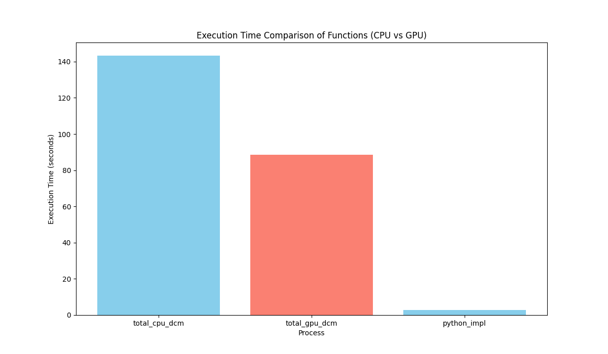

## GLCM with CUDA

This is a Proof of concept of a GLCM implementation using CUDA.
The idea is to use the GPU to calculate the GLCM matrix and then use the CPU to calculate the features and export it to a
CSV file to be input in a machine learning model/cnn/transformer.

## Evaluation
We will run a glcm algorithm in the CPU and in the GPU and compare the results and the time it takes to run the algorithm.
Running for a small set of image we already have the following results:

Result for 275 Dicom images



## Run
```bash
mkdir build/
cd build/
cmake .. & make
```
to run the gpu program 
```bash
mkdir build/
cd build/
cmake .. & make
make run
```

to run the cpu program
```bash
mkdir build/
cd build/
cmake .. & make 
./glcm_cpu
```

Then you can plot the graph for comparison the CPU approach and the GPU approach
`python -m venv venv && . ./venv/bin/activate && pip install -r requirements.txt`

```bash python plot_total.py ```
this will save in the disk

## Cofig

### GPU Status Report
**Date:** Wed Nov 13 17:43:41 2024

```plaintext
+-----------------------------------------------------------------------------------------+
| NVIDIA-SMI 560.35.03              Driver Version: 560.35.03      CUDA Version: 12.6     |
|-----------------------------------------+------------------------+----------------------+
| GPU  Name                 Persistence-M | Bus-Id          Disp.A | Volatile Uncorr. ECC |
| Fan  Temp   Perf          Pwr:Usage/Cap |           Memory-Usage | GPU-Util  Compute M. |
|                                         |                        |               MIG M. |
|=========================================+========================+======================|
|   0  NVIDIA GeForce GTX 1650        Off |   00000000:2B:00.0  On |                  N/A |
|  0%   52C    P3             N/A /   75W |     854MiB /   4096MiB |      1%      Default |
|                                         |                        |                  N/A |
+-----------------------------------------+------------------------+----------------------+

+-----------------------------------------------------------------------------------------+
| Processes:                                                                              |
|  GPU   GI   CI        PID   Type   Process name                              GPU Memory |
|        ID   ID                                                               Usage      |
|=========================================================================================|
|    0   N/A  N/A      1283      G   /usr/lib/Xorg                                 554MiB |
|    0   N/A  N/A      1739      G   picom                                          71MiB |
|    0   N/A  N/A      1824      G   alacritty                                       8MiB |
|    0   N/A  N/A      2526      G   ...35,262144 --variations-seed-version        215MiB |
+-----------------------------------------------------------------------------------------+
```
## Dependencies 

First you need to have the 
[submodule "lodepng"]
	path = lodepng
	url = git@github.com:lvandeve/lodepng.git

git submodule update --init --recursive

Then you need to have the dcmtk library installed on your system,

it needs dcmtk to be installed on 
arch linux run  ```sudo pacman -S dcmtk``` or ```yay -S dcmtk```
on fedora ```sudo dnf install dcmtk```
and on ubuntu ```sudo apt-get install dcmtk```


## References papers

