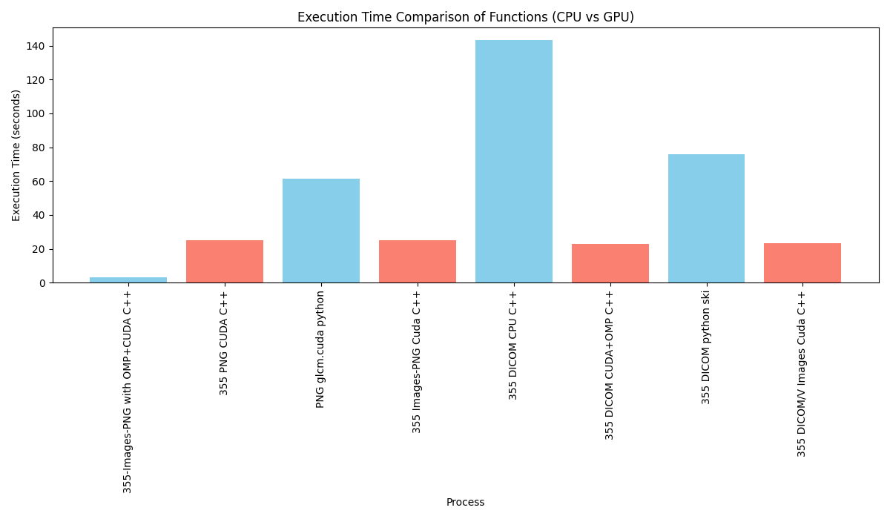

## GLCM with CUDA

This is a Proof of concept of a GLCM implementation using CUDA.
The idea is to use the GPU to calculate the GLCM matrix and then use the CPU to calculate the features and export it to a
CSV file to be input in a machine learning model/cnn/transformer.


### GLCM Algorithm

* Counting Pairs: For each pair of pixels, the first pixel has an intensity I, and its neighbor 
(determined by a displacement vector d) has an intensity J For every such pair in the image, a count is incremented in the [I,J]-th cell of the matrix.
The displacement vector defines the spatial relationship (e.g., neighbor one pixel to the right, one above, or diagonally).

* Populating the GLCM: Each [I,J]-th entry in the GLCM holds the count of occurrences where a pixel of intensity III is paired with a 
neighboring pixel of intensity J, based on the defined displacement.

* Symmetry and Counts: The matrix is not necessarily symmetric because the relationship is directional. 
For instance, counting a pixel III with a rightward neighbor J may not yield the same count as a pixel J with a rightward neighbor 
I. However, if symmetry is desired (e.g., for certain texture analysis methods), the GLCM can be made symmetric by adding it to its transpose.

To follow the code you can check main.cu for the gpu implementation and main_cpu.cpp for the cpu implementation, to run the code check `#run` section


## How the cuda code works for the matrix
```python
[0, 1, 0, 0, 2
 1, 0, 0, 3, 2
 2, 0, 0, 1, 1
 3, 1, 1, 3, 2
 4, 4, 0, 2, 1]
```
* The number of n_row = 5, n_col = 5
* glcm_max = 5 (assuming gray levels are from 0 to 4)
* Direction: dx = 1, dy = 0 (0° direction - horizontal neighbors)
* Blocks = 5, Threads per block = 5, total threads = 25.
* Global index calculation: idx = blockIdx.x * blockDim.x + threadIdx.x

* With 5 blocks and 5 threads each:
    - Block 0: idx = 0..4
    - Block 1: idx = 5..9
    - Block 2: idx = 10..14
    - Block 3: idx = 15..19
    - Block 4: idx = 20..24

Thread-by-Thread Updates:
- idx=0: (row=0, col=0) neighbor=(0,1)
    - current=matrix[0]=0, neighbor=matrix[1]=1
    - glcm(0,1)++

- idx=1: (0,1) neighbor=(0,2)
    - current=1, neighbor=0
    - glcm(1,0)++

- idx=2: (0,2) neighbor=(0,3)
    - current=0, neighbor=0
    - glcm(0,0)++

- idx=3: (0,3) neighbor=(0,4)
    - current=0, neighbor=2
    - glcm(0,2)++

- idx=4: (0,4) neighbor=(0,5 out of bounds) no update

- idx=5: (1,0) neighbor=(1,1)
    - current=1, neighbor=0
    - glcm(1,0)++ (again)

- idx=6: (1,1) neighbor=(1,2)
    - current=0, neighbor=0
    - glcm(0,0)++ (again)

- idx=7: (1,2) neighbor=(1,3)
    - current=0, neighbor=3
    - glcm(0,3)++

- idx=8: (1,3) neighbor=(1,4)
    - current=3, neighbor=2
    - glcm(3,2)++

- idx=9: (1,4) neighbor=(1,5 out of bounds) no update
- idx=10: (2,0) neighbor=(2,1)
    - current=2, neighbor=0
    - glcm(2,0)++

- idx=11: (2,1) neighbor=(2,2)
    - current=0, neighbor=0
    - glcm(0,0)++ (again)

- idx=12: (2,2) neighbor=(2,3)
    - current=0, neighbor=1
    - glcm(0,1)++ (again)

- idx=13: (2,3) neighbor=(2,4)
    - current=1, neighbor=1
    - glcm(1,1)++

- idx=14: (2,4) neighbor=(2,5 out of bounds) no update
- idx=15: (3,0) neighbor=(3,1)
    - current=3, neighbor=1
    - glcm(3,1)++

- idx=16: (3,1) neighbor=(3,2)
    - current=1, neighbor=1
    - glcm(1,1)++ (again)

- idx=17: (3,2) neighbor=(3,3)
    - current=1, neighbor=3
    - glcm(1,3)++

- idx=18: (3,3) neighbor=(3,4)
    - current=3, neighbor=2
    - glcm(3,2)++ (again)

- idx=19: (3,4) neighbor=(3,5 out of bounds) no update
- idx=20: (4,0) neighbor=(4,1)
    - current=4, neighbor=4
    - glcm(4,4)++

- idx=21: (4,1) neighbor=(4,2)
    - current=4, neighbor=0
    - glcm(4,0)++

- idx=22: (4,2) neighbor=(4,3)
    - current=0, neighbor=2
    - glcm(0,2)++ (again)

- idx=23: (4,3) neighbor=(4,4)
    - current=2, neighbor=1
    - glcm(2,1)++

- idx=24: (4,4) neighbor=(4,5 out of bounds) no update


Let's count how many times each pair incremented:
glcm(0,0): incremented at idx=2,6,11 → total 3
glcm(0,1): idx=0,12 → total 2
glcm(0,2): idx=3,22 → total 2
glcm(0,3): idx=7 → total 1
glcm(1,0): idx=1,5 → total 2
glcm(1,1): idx=13,16 → total 2
glcm(1,3): idx=17 → total 1
glcm(2,0): idx=10 → total 1
glcm(2,1): idx=23 → total 1
glcm(3,1): idx=15 → total 1
glcm(3,2): idx=8,18 → total 2
glcm(4,0): idx=21 → total 1
glcm(4,4): idx=20 → total 1

```python

   j=0 j=1 j=2 j=3 j=4
i=0  3   2   2   1   0
i=1  2   2   0   1   0
i=2  1   1   0   0   0
i=3  0   1   2   0   0
i=4  1   0   0   0   1
```


## Run

First you need to install some dependencies,  you need to clone the lodepng submodule, `git submodule update --init --recursive` it is used
to read png images

```bash
[submodule "lodepng"]
	path = lodepng
	url = git@github.com:lvandeve/lodepng.git

```

Then you need to have the `dcmtk ` library installed on your system, used to read dicom images, to install in the Ubutu run `sudo apt-get install dcmtk`
the system used to develop this code was arch linux which can be installed running `sudo pacman -S dcmtk` or `yay -S dcmtk` for fedora `sudo dnf install dcmtk`

Also you need to have the `cuda` installed on your system, to install it you can follow the instructions on the [nvidia website](https://developer.nvidia.com/cuda-downloads)
The version used was  Cuda Version: 12.6
after that you can run build

The images used to evaluate the runtime are in the dataset/ST000001 (dicom images) and inside the data/

before you need to change
in the `main_cpu.cpp` the variables to your path to the dataset
```c++
  std::string folder = "data";
  std::string folder_dcm = "/home/chico/m/chico/glcm.cuda/dataset";
```
do the same for the `main.cu` file
```c++
  std::string folder = "/home/chico/m/chico/glcm.cuda/data/images_png/";
  std::string folder_dcm = "/home/chico/m/chico/glcm.cuda/dataset";
```

to clone the images you can get on the [dataset](https://github.com/matheusfrancisco/glcm.cuda/tree/main/dataset/ST000001) 
and the png images on [data/images_png](https://github.com/matheusfrancisco/glcm.cuda/tree/main/data/images_png)

after changing the path you can run the following commands to build the code

```bash
mkdir build/
cd build/
cmake .. & make
```
to run the gpu program 
```bash
mkdir build/
cd build/
cmake .. & make
make run
```

to run the cpu program
```bash
mkdir build/
cd build/
cmake .. & make 
./glcm_cpu
```

to run the python implementation
```bash 
cd benchmark
&& pip install -r requirements.txt 
&& python glcm.py
```


Then you can plot the graph for comparison the CPU approach and the GPU approach
`python -m venv venv && . ./venv/bin/activate && pip install -r requirements.txt`

```bash 
python plot_total.py
```
this will save in the disk

Inside the `benchmark` folder there are two other implementation of GLCM in python, one using the skimage and the other using the glcm_cuda python 
implementation, go there to check how to run


## Env used to develop this code

### GPU Status Report
**Date:** Wed Nov 13 17:43:41 2024

```plaintext
+-----------------------------------------------------------------------------------------+
| NVIDIA-SMI 560.35.03              Driver Version: 560.35.03      CUDA Version: 12.6     |
|-----------------------------------------+------------------------+----------------------+
| GPU  Name                 Persistence-M | Bus-Id          Disp.A | Volatile Uncorr. ECC |
| Fan  Temp   Perf          Pwr:Usage/Cap |           Memory-Usage | GPU-Util  Compute M. |
|                                         |                        |               MIG M. |
|=========================================+========================+======================|
|   0  NVIDIA GeForce GTX 1650        Off |   00000000:2B:00.0  On |                  N/A |
|  0%   52C    P3             N/A /   75W |     854MiB /   4096MiB |      1%      Default |
|                                         |                        |                  N/A |
+-----------------------------------------+------------------------+----------------------+

+-----------------------------------------------------------------------------------------+
| Processes:                                                                              |
|  GPU   GI   CI        PID   Type   Process name                              GPU Memory |
|        ID   ID                                                               Usage      |
|=========================================================================================|
|    0   N/A  N/A      1283      G   /usr/lib/Xorg                                 554MiB |
|    0   N/A  N/A      1739      G   picom                                          71MiB |
|    0   N/A  N/A      1824      G   alacritty                                       8MiB |
|    0   N/A  N/A      2526      G   ...35,262144 --variations-seed-version        215MiB |
+-----------------------------------------------------------------------------------------+
```

## Evaluation
We will run a glcm algorithm in the CPU and in the GPU and compare the results and the time it takes to run the algorithm.
Running for a small set of image we already have the following results:




## References papers


The importance of have fast glcm algorithms calculation Recente papers

[Another Parallelism Technique of GLCM Implementation Using CUDA Programming](https://www.researchgate.net/publication/347433994_Another_Parallelism_Technique_of_GLCM_Implementation_Using_CUDA_Programming)
[GLCM based parallel texture segmentation using a multicore processor](https://www.semanticscholar.org/paper/GLCM-based-parallel-texture-segmentation-using-a-Dawwd/ed7000524daa83923b0584ee596d36eda1fda8e0)
[Image Texture Analysis Feature Extraction Using GLCM](https://citeseerx.ist.psu.edu/document?repid=rep1&type=pdf&doi=e3c9c7d735c1fd8319e34fd3db37973c44802a68#page=291)
[GLCM-Based Feature Combination for Extraction Model Optimization in Object Detection Using Machine Learning](https://arxiv.org/abs/2404.04578)
[Brain tumor detection using GLCM features and classifiers](https://pubs.aip.org/aip/acp/article-abstract/2725/1/020010/2880680/Brain-tumor-detection-using-GLCM-features-and?redirectedFrom=fulltext)
[Effect of Using GLCM and LBP+HOG Feature Extraction on SVM Method in Classification of Human Skin Disease Type](https://ejournal.unitomo.ac.id/index.php/inform/article/view/8275)
[Grey Level Co-occurrence Matrix (GLCM) Based Second Order Statistics for Image Texture Analysis](https://arxiv.org/abs/2403.04038)
[The Effects of GLCM parameters on LAI estimation using texture values from Quickbird Satellite Imagery](https://www.nature.com/articles/s41598-017-07951-w)
[Binary Classification of Remotely Sensed Images Using SVD Based GLCM Features in Quantum Framework](https://ieeexplore.ieee.org/abstract/document/10641968?casa_token=sxU7g8pJyIcAAAAA:cZh0_u03-tFuMB1K19M2rgUMlt8JcBdO9eTzd3AE9zozoRvWje_ohs1enf13yLjJi7-ThzEUR8QM)
[Tumor classification algorithm via parallel collaborative optimization of single- and multi-objective consistency on PET/CT](https://www.sciencedirect.com/science/article/pii/S1568494624010196?casa_token=UA7Mc0MdJNIAAAAA:-KvON4Pd9mriT9ejiBWw5fUs-jaI3ezgHAAIIb-jlqjXX4-SJu_P7qkhBkCIhVl3RZmEpTZOM6Lo)


### TODO
- [x] glcm in cpu for 8 directions
- [x] glcm in gpu for 8 directions
- [x] glcm using openmp for 8 directions
- [x] implement normalization in gpu and cpu 
- [x] implement in python and compare with the c++ implementation
- [ ] implement the transpose in gpu
- [ ] implement features in gpu and cpu
- [ ] implement average in gpu and cpu
- [ ] implement variance in gpu and cpu
- [ ] implement contrast in gpu and cpu

- [ ] compare with another libs like skimage, opencv, pycuda etc

- [ ] improve cude memory allocation
- [ ] improve cuda memory copy
- [ ] improve cuda memory free
- [ ] try to use streams to improve performance
- [ ] use shared memory to improve performance
- [ ] try remove data dependency


